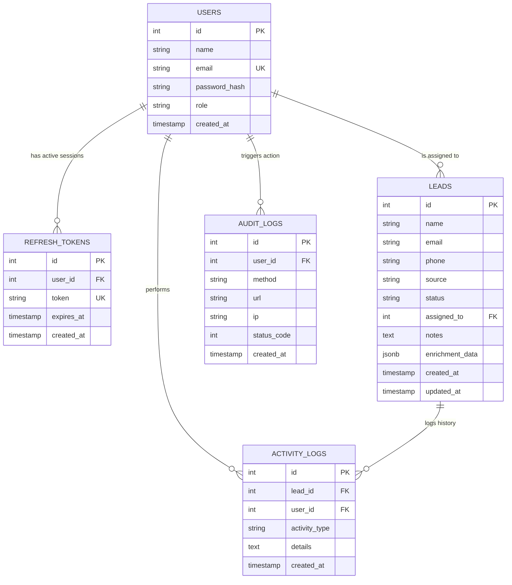

# Database Design & Schema Explanation

This document details the schema layout, normalization decisions, and database indexing strategies for the Mini Lead Management System.

---

## Entity-Relationship (ER) Diagram

---

## Database Normalization
The database design adheres strictly to the **Third Normal Form (3NF)**:
1. **First Normal Form (1NF)**: Every table has a primary key (SERIAL `id`), and all fields contain atomic values.
2. **Second Normal Form (2NF)**: All non-key attributes are fully dependent on the primary key.
3. **Third Normal Form (3NF)**: No transitive dependencies exist. For instance, lead assignee information is represented by a foreign key reference `assigned_to` pointing to the `users` table, rather than storing assignee details directly on the `leads` table.

---

## Schema Tables Detail

### 1. `users` Table
Stores user credentials, name, and authorized role.
- `id` (SERIAL PRIMARY KEY)
- `name` (VARCHAR(100) NOT NULL): Full name.
- `email` (VARCHAR(100) UNIQUE NOT NULL): Unique login identifier.
- `password_hash` (VARCHAR(255) NOT NULL): Hashed password (bcrypt).
- `role` (VARCHAR(20) NOT NULL CHECK in `admin`, `manager`, `agent`).
- `created_at` (TIMESTAMP DEFAULT CURRENT_TIMESTAMP).

### 2. `refresh_tokens` Table
Supports stateful user sessions and token refresh rotation.
- `id` (SERIAL PRIMARY KEY)
- `user_id` (INTEGER REFERENCES users(id) ON DELETE CASCADE): Ties session to user. Cascade deletes sessions if the user is deleted.
- `token` (VARCHAR(512) UNIQUE NOT NULL): Stateful refresh token.
- `expires_at` (TIMESTAMP NOT NULL): Absolute session expiry timestamp.
- `created_at` (TIMESTAMP DEFAULT CURRENT_TIMESTAMP).

### 3. `leads` Table
Stores lead contact info, pipeline status, source, notes, assignee, and external enrichment data.
- `id` (SERIAL PRIMARY KEY)
- `name` (VARCHAR(100) NOT NULL).
- `email` (VARCHAR(100) NOT NULL).
- `phone` (VARCHAR(20) NULL).
- `source` (VARCHAR(50) NOT NULL): E.g., `web`, `referral`, `advertisement`.
- `status` (VARCHAR(50) DEFAULT 'new' CHECK in `new`, `contacted`, `qualified`, `proposal`, `won`, `lost`).
- `assigned_to` (INTEGER REFERENCES users(id) ON DELETE SET NULL): References assignee. If the assignee user is deleted, the lead remains in the system but becomes unassigned.
- `notes` (TEXT): Free-form notes.
- `enrichment_data` (JSONB): Semi-structured data returned from the RandomUser API.
- `created_at` (TIMESTAMP DEFAULT CURRENT_TIMESTAMP).
- `updated_at` (TIMESTAMP DEFAULT CURRENT_TIMESTAMP).

### 4. `activity_logs` Table
Maintains audit trail of changes made to individual leads.
- `id` (SERIAL PRIMARY KEY)
- `lead_id` (INTEGER REFERENCES leads(id) ON DELETE CASCADE): Ties log to lead. Deleted automatically if the lead is deleted.
- `user_id` (INTEGER REFERENCES users(id) ON DELETE SET NULL): Identifies the user who triggered the log.
- `activity_type` (VARCHAR(50) NOT NULL): E.g., `lead_created`, `lead_updated`, `lead_assigned`, `status_changed`.
- `details` (TEXT): Human-readable details.
- `created_at` (TIMESTAMP DEFAULT CURRENT_TIMESTAMP).

### 5. `audit_logs` Table
Maintains global HTTP request audits for security monitoring.
- `id` (SERIAL PRIMARY KEY).
- `user_id` (INTEGER REFERENCES users(id) ON DELETE SET NULL): Ties to authenticated user, if any.
- `method` (VARCHAR(10) NOT NULL): HTTP method (`GET`, `POST`, `PUT`, `DELETE`).
- `url` (VARCHAR(255) NOT NULL): Requested path.
- `ip` (VARCHAR(45)): Client IP address.
- `status_code` (INTEGER): HTTP response status.
- `created_at` (TIMESTAMP DEFAULT CURRENT_TIMESTAMP).

---

## Indexing & Performance Optimizations
To ensure rapid query execution under load, we have created specific indices:
- **`idx_users_email`** on `users(email)`: Speeds up authentication lookups.
- **`idx_leads_assigned_to`** on `leads(assigned_to)`: Optimizes dashboard workload counts and role-based listings for Agents.
- **`idx_leads_status`** and **`idx_leads_source`** on `leads(status)` and `leads(source)`: Speeds up tabular filtering and aggregate dashboard queries.
- **`idx_activity_logs_lead_id`** on `activity_logs(lead_id)`: Speeds up loading activity history on the Lead Details page.
- **`idx_refresh_tokens_token`** on `refresh_tokens(token)`: Speeds up token rotation lookup.
